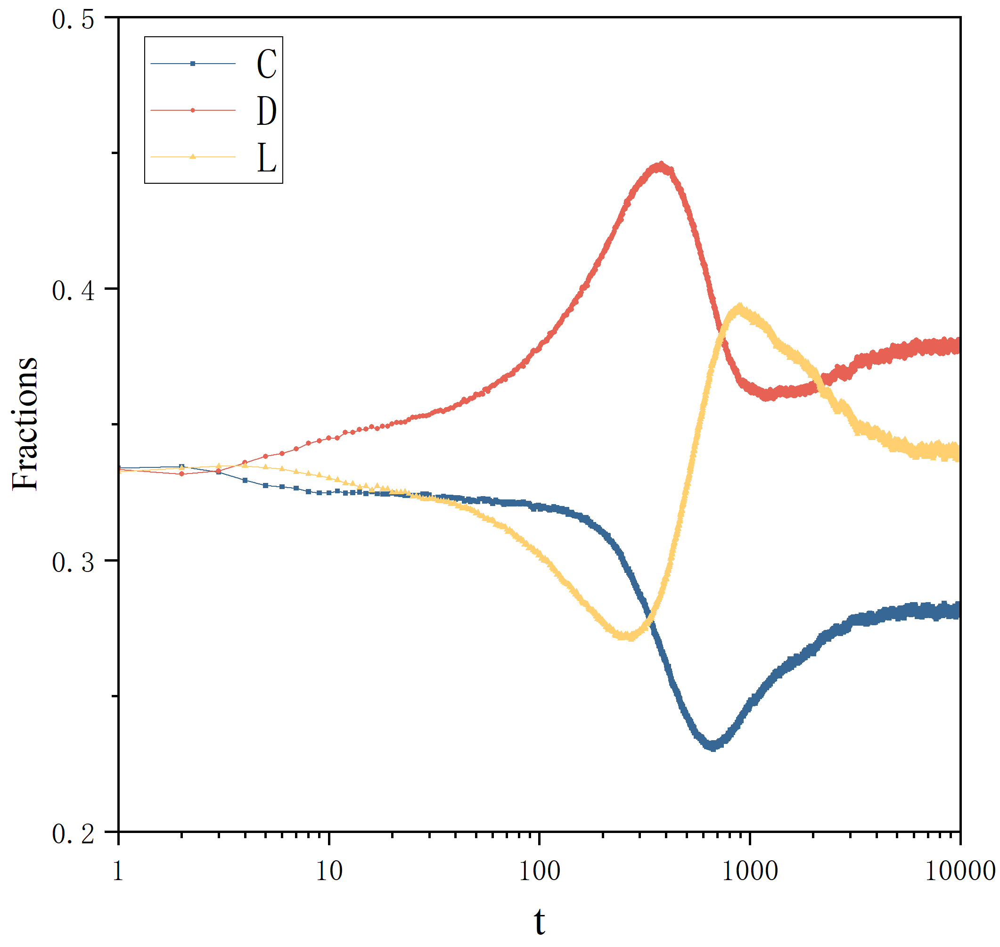
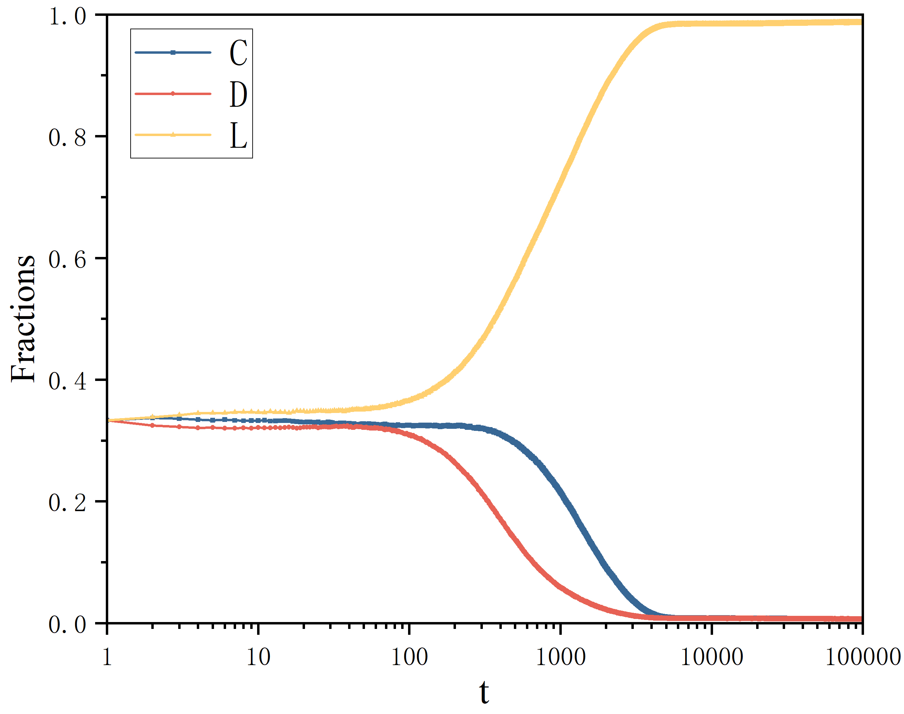

# PGG-with-Loner-and-RL
Imitation and replication have emerged as a paradigm in numerous studies that explore the evolution of cooperative behavior. Since they embrace the essence of natural selection, it is widely recognized in exploring the evolution of biological behaviors. However, it is not easy to express the way individuals select and optimize in these simple and elegant ways in the complex and variable interactive environments. Currently, reinforcement learning is widely used in the study of strategy updating dynamics and agent learning processes in game theory. Therefore, we introduce the Q-learning algorithms into the voluntary public goods game to explore the impact of cooperative evolution.

This repository hosts the source code of paper of "Exploring cooperative evolution with tunable payoff's loners using reinforcement learning"

## Requirements
It is worth mentioning that because python runs slowly, we use **numba** library to improve the speed of code running.
* networkx==3.1
* numba==0.57.0
* numpy==1.23.0
* pandas==2.0.2
* scipy==1.11.1
* seaborn==0.12.2
* tqdm==4.65.0

## Setup
The installation of PGG-with-Loner-and-RL is very easy. We've tested PGG-with-Loner-and-RL on Python 3.10 and above. We strongly recommend using conda to manage your dependencies, and avoid version conflicts. Here we show the example of building python 3.10 based conda environment.
****
```
conda create -n pggrl python==3.10.2 -y
conda activate pggrl
pip install -r requirements.txt
```

## Runing
```
python pggrl.py
```

## Results
The core code of paper is provided here. 'pggrl.py' can plot the evolutionary process of various strategies under various parameter settings. Other results in the paper can be obtained by modifying this code. The example  of  results which are obtained from 'pggrl.py' are shown below:



## Citation
 Please cite this work if you find it useful:
```
@article{zhou2020learning,
  title={Learning Implicit Credit Assignment for Cooperative Multi-Agent Reinforcement Learning}, 
  author={Meng Zhou and Ziyu Liu and Pengwei Sui and Yixuan Li and Yuk Ying Chung},
  journal={arXiv preprint arXiv:2007.02529},
  year={2020}
}
```

## Contact
Please email zhz943600@gmail.com for further questions.
